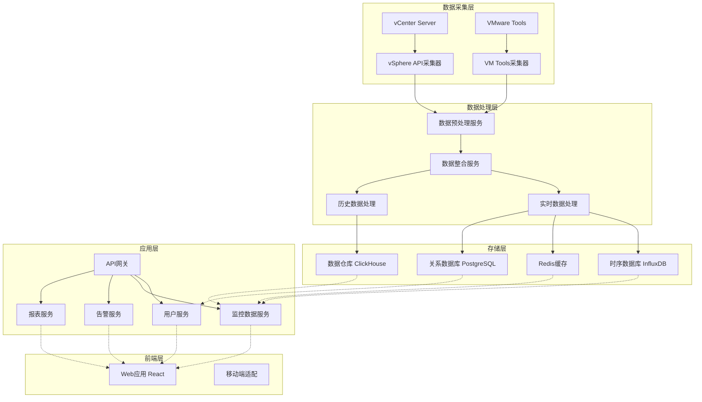
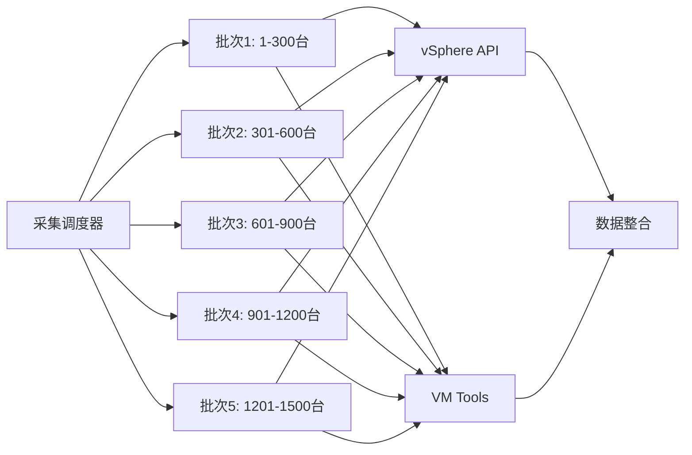
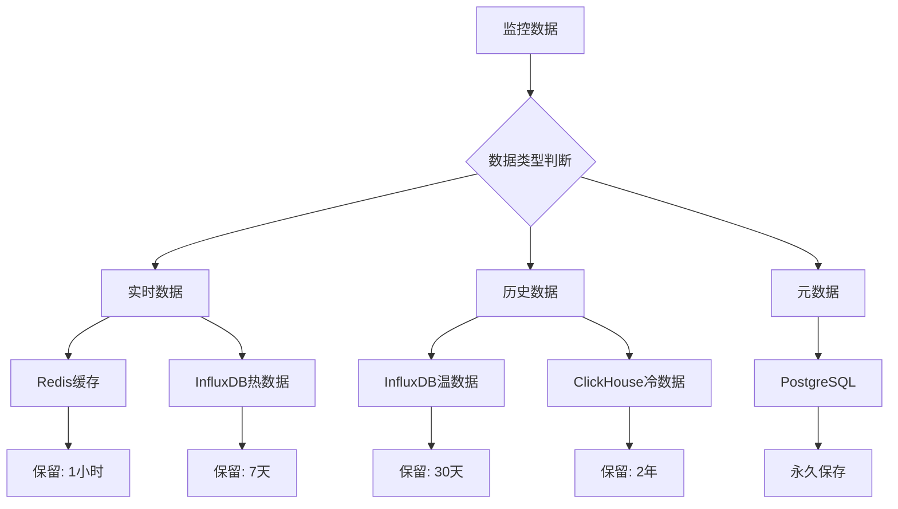
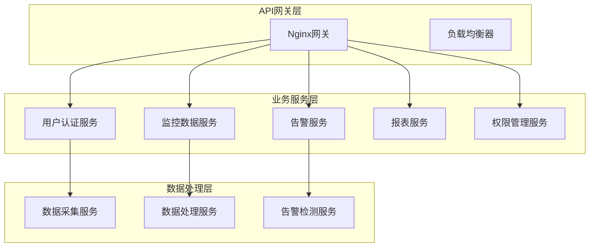
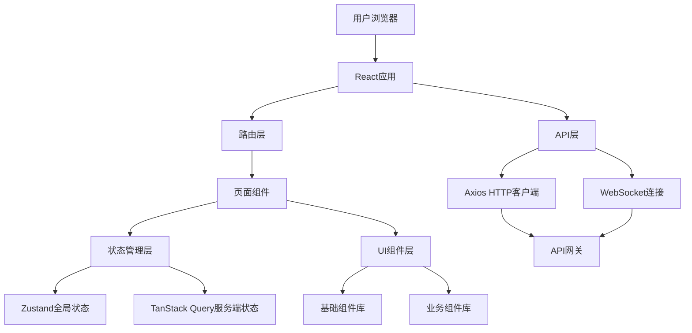
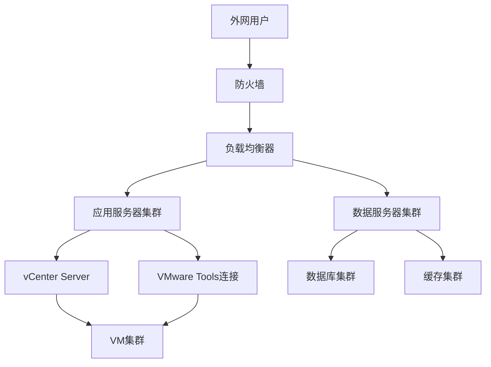
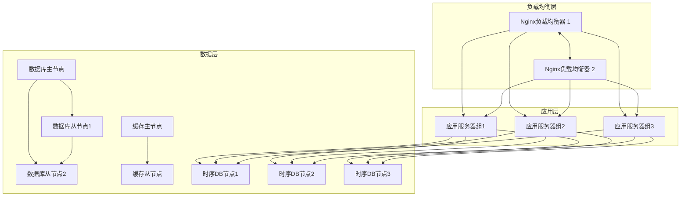

# INFRA_20260202_VM监控系统_基础设施架构

## 文档履历

| 版本 | 日期 | 修改人 | 修改内容 | 审核状态 |
|------|------|--------|----------|----------|
| v1.0 | 2026-02-02 | 基础设施架构师 | 初始版本，完整的基础设施架构设计 | 🔄 待审核 |

---

## 架构概述

### 系统定位
企业级VM监控系统，支持1500+台VM的实时监控、历史数据分析、告警管理和用户权限控制。

### 核心架构原则
- **高可用性**: 99.9%系统可用性
- **高性能**: 60秒内完成1500台VM数据采集
- **可扩展性**: 支持扩展到5000台VM
- **安全性**: 端到端加密和权限控制
- **可维护性**: 模块化设计，便于运维

---

## 整体架构设计

### 系统架构图


---

## 数据采集架构

### 采集策略设计

#### 分层采集架构


#### 采集性能优化
- **分批采集**: 每批300台VM，5批次并行处理
- **采集频率**: 30-60秒可配置
- **API连接池**: 每个vCenter最多50个并发连接
- **智能调度**: 根据网络状况动态调整采集频率

### VMware集成架构

#### vSphere API集成
```yaml
vSphere API配置:
  连接管理:
    - API版本: vSphere API 6.5+
    - 连接池大小: 50个并发连接
    - 连接超时: 30秒
    - 重试策略: 指数退避，最大3次重试
  
  指标采集:
    - 采集频率: 30秒
    - 采集指标: CPU、内存、存储、网络、电源状态
    - 数据格式: VMware性能数据格式
    - 批量查询: 使用QueryPerfCounter方法批量查询
  
  监控对象:
    - 虚拟机 (VirtualMachine)
    - 主机 (HostSystem)
    - 数据存储 (Datastore)
    - 网络适配器 (Network)
```

#### VMware Tools集成
```yaml
VMware Tools配置:
  连接方式:
    - SSH (Linux): 使用SSH连接VM执行命令
    - WinRM (Windows): 使用WinRM连接Windows VM
    - 连接超时: 15秒
    - 并发连接: 最多100个并发连接
  
  指标采集:
    - Linux命令:
      - CPU: /proc/stat, mpstat
      - 内存: free -m, vmstat
      - 磁盘: df -h, iostat
      - 网络: ifconfig, sar
      - 进程: ps aux, top
    - Windows命令:
      - CPU: Get-WmiObject Win32_Processor
      - 内存: Get-WmiObject Win32_OperatingSystem
      - 磁盘: Get-WmiObject Win32_LogicalDisk
      - 网络: Get-WmiObject Win32_NetworkAdapter
      - 进程: Get-Process
  
  自定义脚本:
    - 支持用户自定义监控脚本
    - 脚本执行超时: 30秒
    - 结果格式: JSON格式输出
```

---

## 数据存储架构

### 存储策略设计

#### 分层存储架构


#### 存储系统配置

**Redis缓存配置**
```yaml
Redis配置:
  用途: 实时数据缓存、会话管理
  容量: 32GB
  数据保留: 1小时
  集群模式: 主从复制 + 哨兵模式
  持久化: RDB + AOF混合持久化
  
  数据结构:
    - String: 实时指标数据 (TTL: 3600s)
    - Hash: 用户会话信息 (TTL: 28800s)
    - List: 告警队列
    - SortedSet: VM健康度排序
```

**InfluxDB配置**
```yaml
InfluxDB配置:
  版本: InfluxDB 2.x
  集群: 3节点集群
  存储引擎: TSM (Time-Structured Merge Tree)
  
  数据保留策略:
    - hot数据: 7天 (高频查询)
    - warm数据: 30天 (中频查询)
    - 数据压缩: 使用Gorilla压缩算法
  
  分片策略:
    - 按VM ID分片
    - 按时间范围分片 (每天一个分片)
    
  索引设计:
    - 复合索引: (vm_id, timestamp)
    - 复合索引: (timestamp, metric_type)
```

**ClickHouse配置**
```yaml
ClickHouse配置:
  版本: ClickHouse 22.x
  集群: 3节点复制集群
  用途: 历史数据分析、报表生成
  
  分区策略:
    - 按日期分区 (PARTITION BY toYYYYMMDD(timestamp))
    - 按VM ID分桶 (ORDER BY (vm_id, timestamp))
    
  压缩算法:
    - ZSTD压缩算法
    - 压缩比: 10:1
    
  数据保留: 2年
  自动清理: 删除超过2年的数据
```

**PostgreSQL配置**
```yaml
PostgreSQL配置:
  版本: PostgreSQL 14+
  集群: 主从复制 + 读写分离
  用途: 用户管理、权限管理、配置数据
  
  数据库设计:
    - users: 用户信息表
    - roles: 角色权限表
    - vms: VM元数据表
    - alert_rules: 告警规则表
    - alert_history: 告警历史表
    
  性能优化:
    - 连接池: PgBouncer连接池
    - 查询缓存: pg_query_cache
    - 索引优化: 复合索引、部分索引
```

---

## 后端架构设计

### 微服务架构

#### 服务划分


#### 技术栈选择
```yaml
后端技术栈:
  主要语言: Node.js 18+ (TypeScript)
  
  框架和库:
    - API框架: Express.js / NestJS
    - ORM: Prisma
    - 验证: Zod
    - 日志: Winston
    - 监控: Prometheus + Grafana
  
  微服务框架:
    - 服务发现: Consul
    - API网关: Kong / Nginx
    - 消息队列: RabbitMQ
    - 缓存: Redis
  
  开发工具:
    - 包管理: pnpm
    - 测试框架: Jest
    - API文档: Swagger/OpenAPI
    - CI/CD: GitHub Actions
```

#### 服务详细设计

**用户认证服务**
```typescript
// 服务职责
interface UserService {
  // 用户认证
  authenticate(username: string, password: string): Promise<UserSession>;
  
  // 权限验证
  verifyPermission(userId: string, permission: string): Promise<boolean>;
  
  // 会话管理
  createSession(userId: string, deviceId: string): Promise<SessionToken>;
  validateSession(token: string): Promise<SessionInfo>;
  
  // 多语言支持
  getUserLanguage(userId: string): Promise<Language>;
  setUserLanguage(userId: string, language: Language): Promise<void>;
}

// 技术实现
const userService = {
  framework: 'NestJS',
  database: 'PostgreSQL',
  cache: 'Redis',
  authentication: 'JWT + OAuth2',
  sessionManagement: 'Redis Sessions'
};
```

**监控数据服务**
```typescript
// 服务职责
interface MonitoringDataService {
  // 实时数据查询
  getRealtimeData(vmId: string): Promise<MonitoringData>;
  getBatchRealtimeData(vmIds: string[]): Promise<MonitoringData[]>;
  
  // 历史数据查询
  getHistoricalData(
    vmId: string,
    startTime: Date,
    endTime: Date,
    metrics: string[]
  ): Promise<HistoricalData>;
  
  // 数据聚合
  aggregateData(
    vmIds: string[],
    timeRange: TimeRange,
    aggregation: AggregationType
  ): Promise<AggregatedData>;
  
  // 异常检测
  detectAnomalies(vmId: string, timeRange: TimeRange): Promise<Anomaly[]>;
}

// 技术实现
const monitoringDataService = {
  framework: 'Express.js',
  databases: {
    realtime: 'InfluxDB',
    historical: 'ClickHouse',
    cache: 'Redis'
  },
  dataProcessing: 'Data streams with Node.js',
  apiVersion: 'v1'
};
```

**告警服务**
```typescript
// 服务职责
interface AlertService {
  // 告警规则管理
  createAlertRule(rule: AlertRule): Promise<AlertRule>;
  updateAlertRule(ruleId: string, rule: AlertRule): Promise<AlertRule>;
  deleteAlertRule(ruleId: string): Promise<void>;
  
  // 告警检测
  evaluateAlertRules(): Promise<AlertEvaluationResult[]>;
  
  // 告警通知
  sendNotification(alert: Alert): Promise<NotificationResult>;
  
  // 告警历史
  getAlertHistory(filters: AlertFilters): Promise<Alert[]>;
  
  // 多语言通知
  generateAlertMessage(alert: Alert, language: Language): Promise<string>;
}

// 技术实现
const alertService = {
  framework: 'NestJS',
  messageQueue: 'RabbitMQ',
  notificationProviders: {
    email: 'Nodemailer',
    sms: 'Twilio / 阿里云短信'
  },
  database: 'PostgreSQL'
};
```

---

## 前端架构设计

### 前端技术栈
```yaml
前端技术栈:
  主要框架: React 18+
  语言: TypeScript 5+
  
  状态管理:
    - 全局状态: Zustand / Redux Toolkit
    - 服务端状态: TanStack Query
  
  UI框架:
    - 组件库: Material-UI (MUI) / Ant Design
    - 图表库: Recharts / ECharts / Plotly
    - 数据表格: React Table / AG Grid
  
  国际化:
    - i18n框架: react-i18next
    - 支持语言: en, zh-CN, ja-JP
  
  构建工具:
    - 构建器: Vite
    - 代码分割: React.lazy + Suspense
    - CSS: Tailwind CSS
  
  测试:
    - 单元测试: Vitest
    - 集成测试: Testing Library
    - E2E测试: Playwright
```

### 应用架构设计


### 性能优化策略
```typescript
// 前端性能优化策略
const performanceOptimization = {
  // 代码优化
  codeSplitting: {
    strategy: '路由级别代码分割',
    tool: 'React.lazy() + Suspense',
    loading: '骨架屏加载状态'
  },
  
  // 数据优化
  dataOptimization: {
    caching: 'TanStack Query缓存策略',
    pagination: '虚拟滚动 + 分页加载',
    compression: 'gzip + brotli压缩'
  },
  
  // 渲染优化
  renderingOptimization: {
    virtualization: 'react-window虚拟列表',
    memoization: 'React.memo + useMemo',
    debouncing: 'Lodash防抖节流'
  },
  
  // 资源优化
  resourceOptimization: {
    images: 'WebP格式 + 懒加载',
    fonts: '字体子集化 + 预加载',
    icons: 'SVG图标 + 内联关键图标'
  }
};
```

---

## 网络架构设计

### 网络拓扑设计


### 网络安全配置
```yaml
网络安全配置:
  防火墙规则:
    入站规则:
      - 允许: HTTPS (443) 用于Web访问
      - 允许: SSH (22) 用于运维管理
      - 拒绝: 所有其他入站连接
    
    出站规则:
      - 允许: vCenter API (443)
      - 允许: SSH (22) 到VM
      - 允许: WinRM (5985/5986) 到Windows VM
      - 允许: SMTP (25/587) 用于邮件通知
      - 允许: HTTP/HTTPS (80/443) 用于短信API
  
  网络隔离:
    - DMZ区域: Web服务器、API网关
    - 应用区域: 业务服务、数据处理
    - 数据区域: 数据库、缓存
    - 管理区域: vCenter、监控管理
  
  VLAN划分:
    - VLAN 10: 外网访问
    - VLAN 20: 应用服务器
    - VLAN 30: 数据库服务器
    - VLAN 40: vCenter管理
    - VLAN 50: VMware网络
```

---

## 安全架构设计

### 安全策略设计
```yaml
安全策略:
  身份认证:
    - 方式: JWT + OAuth2
    - 多因素认证: 预留MFA接口
    - 密码策略: 最小12字符，复杂度要求
    - 会话超时: 8小时无操作自动登出
  
  访问控制:
    - 权限模型: RBAC (基于角色的访问控制)
    - 权限粒度: 功能级别权限控制
    - 角色继承: 支持角色层级和权限继承
    - 权限审计: 完整的权限变更日志
  
  数据加密:
    - 传输加密: TLS 1.3
    - 存储加密: AES-256 (数据库字段加密)
    - 密码加密: bcrypt (成本因子12)
    - API加密: HTTPS强制加密
  
  安全审计:
    - 审计范围: 用户操作、权限变更、配置修改
    - 审计日志: 不可变日志存储
    - 日志保留: 至少1年
    - 异常检测: 实时异常行为监控
```

### 权限系统设计
```typescript
// 权限系统数据模型
interface Permission {
  id: string;
  name: string;
  description: string;
  module: 'monitoring' | 'alerts' | 'system' | 'users';
  resource: string; // 具体资源
  action: 'read' | 'write' | 'delete' | 'manage';
}

interface Role {
  id: string;
  name: string;
  description: string;
  parentId?: string; // 父角色，支持继承
  permissions: Permission[]; // 直接授予的权限
  inheritedPermissions: Permission[]; // 继承的权限
  users: string[]; // 角色下的用户
}

interface User {
  id: string;
  username: string;
  email: string;
  roles: Role[]; // 用户拥有的角色
  extraPermissions: Permission[]; // 额外授予的权限
  finalPermissions: Permission[]; // 最终权限（合并计算）
}

// 权限计算逻辑
const calculateFinalPermissions = (user: User): Permission[] => {
  // 1. 获取用户所有角色的直接权限
  const directPermissions = user.roles.flatMap(role => role.permissions);
  
  // 2. 获取用户所有角色的继承权限
  const inheritedPermissions = user.roles.flatMap(role => role.inheritedPermissions);
  
  // 3. 合并所有权限（去重）
  const allPermissions = new Set([
    ...directPermissions,
    ...inheritedPermissions,
    ...user.extraPermissions
  ]);
  
  // 4. 检测权限冲突
  const conflicts = detectPermissionConflicts(allPermissions);
  
  // 5. 如果有冲突，拒绝保存
  if (conflicts.length > 0) {
    throw new PermissionConflictError(conflicts);
  }
  
  return Array.from(allPermissions);
};
```

---

## 部署架构设计

### 容器化部署
```yaml
容器化部署:
  容器引擎: Docker + Kubernetes
  
  部署策略:
    - 蓝绿部署: 零停机部署
    - 滚动更新: 逐步更新容器
    - 金丝雀发布: 灰度发布新版本
  
  资源配额:
    - API网关: 2核4G * 3个副本
    - 业务服务: 2核2G * 6个副本
    - 数据处理: 4核8G * 3个副本
    - 前端应用: 1核2G * 3个副本
```

### 高可用架构


---

## 监控和运维架构

### 系统监控
```yaml
系统监控:
  基础设施监控:
    - 主机监控: CPU、内存、磁盘、网络
    - 容器监控: Kubernetes Pod状态
    - 网络监控: 流量、延迟、丢包率
    - 存储监控: 磁盘使用率、IOPS
  
  应用监控:
    - API性能: 响应时间、错误率、吞吐量
    - 服务健康: 健康检查、服务依赖
    - 业务指标: 在线用户、告警数量、查询QPS
  
  日志监控:
    - 日志收集: Filebeat + Logstash
    - 日志存储: Elasticsearch
    - 日志分析: Kibana
    - 日志保留: 3个月
  
  监控工具:
    - 指标收集: Prometheus
    - 可视化: Grafana
    - 告警: Alertmanager
    - 链路追踪: Jaeger
```

### 运维自动化
```yaml
运维自动化:
  部署自动化:
    - CI/CD: GitHub Actions
    - 配置管理: Ansible
    - 容器编排: Kubernetes
  
  备份策略:
    - 数据库备份: 每日全量 + 实时增量
    - 配置备份: 版本控制 + 配置中心
    - 文件备份: 定期备份 + 异地存储
    - 恢复测试: 每月演练
  
  灾难恢复:
    - RTO (恢复时间目标): 4小时
    - RPO (恢复点目标): 1小时
    - 演练频率: 每季度一次
    - 异地备份: 数据异地复制
```

---

## 性能优化策略

### 数据采集优化
```typescript
// 数据采集优化策略
const dataCollectionOptimization = {
  // 并行采集
  parallelCollection: {
    strategy: '分批并行采集',
    batchSize: 300, // 每批300台VM
    concurrency: 5, // 5个批次并行
    estimatedTime: '60秒完成1500台VM'
  },
  
  // 智能调度
  intelligentScheduling: {
    loadBalancing: '根据网络状况动态分配批次',
    priorityQueue: '重要VM优先采集',
    adaptiveInterval: '根据系统负载调整采集频率',
    backpressure: '背压控制，防止系统过载'
  },
  
  // 缓存策略
  cachingStrategy: {
    apiCache: 'vCenter API调用缓存 (TTL: 30秒)',
    dataCache: '监控数据Redis缓存 (TTL: 60秒)',
    queryCache: '查询结果缓存 (TTL: 300秒)'
  },
  
  // 压缩传输
  compression: {
    dataCompression: 'GZIP压缩数据传输',
    batchTransmission: '批量传输减少网络开销',
    differentialUpdate: '差分更新减少数据传输量'
  }
};
```

### 数据库优化
```sql
-- 数据库优化策略
const databaseOptimization = {
  // 索引优化
  indexing: {
    realtimeData: '复合索引 (vm_id, timestamp)',
    historicalData: '分区索引 + 本地索引',
    userData: '用户ID索引 + 角色索引'
  },
  
  // 查询优化
  queryOptimization: {
    queryPlan: '使用EXPLAIN分析查询计划',
    materializedView: '物化视图加速常用查询',
    partitionPruning: '分区裁剪减少扫描数据'
  },
  
  // 连接优化
  connectionOptimization: {
    connectionPool: '连接池管理 (PgBouncer)',
    queryCache: '查询缓存 (pg_query_cache)',
    statementTimeout: '查询超时设置'
  }
};
```

---

## 扩展性设计

### 水平扩展
```yaml
水平扩展策略:
  无状态服务:
    - API服务: 可无限水平扩展
    - 数据处理服务: 可水平扩展
    - 前端应用: 可水平扩展
  
  有状态服务:
    - 数据库: 读写分离 + 分库分表
    - 缓存: Redis Cluster集群
    - 消息队列: RabbitMQ集群
  
  存储扩展:
    - InfluxDB: 集群扩展
    - ClickHouse: 集群扩展
    - PostgreSQL: 分片扩展
```

### 功能扩展
```yaml
功能扩展设计:
  插件架构:
    - 监控指标插件: 支持自定义监控指标
    - 告警通知插件: 支持自定义通知渠道
    - 数据采集插件: 支持自定义数据源
  
  API扩展:
    - OpenAPI规范: 标准化的API接口
    - Webhooks: 事件驱动的API扩展
    - GraphQL: 灵活的数据查询接口
```

---

## 成本估算

### 硬件成本
```yaml
硬件需求估算:
  应用服务器:
    - 数量: 6台 (2核4G)
    - 成本: ~$3000/台 * 6 = $18,000
  
  数据服务器:
    - 数据库服务器: 3台 (4核16G) = $6,000/台 * 3 = $18,000
    - 缓存服务器: 2台 (8核32G) = $8,000/台 * 2 = $16,000
    - 时序DB服务器: 3台 (8核32G) = $10,000/台 * 3 = $30,000
  
  存储:
    - SSD存储: 10TB = $5,000
    - HDD存储: 20TB = $3,000
  
  网络设备:
    - 负载均衡器: $3,000
    - 防火墙: $2,000
    - 交换机: $4,000
  
  总计: ~$99,000 (约70万人民币)
```

### 运维成本
```yaml
运维成本估算:
  人力成本:
    - 系统管理员: 2人 * $8,000/月 * 12月 = $192,000/年
    - 开发维护: 1人 * $12,000/月 * 12月 = $144,000/年
  
  网络成本:
    - 带宽费用: $2,000/月 * 12月 = $24,000/年
    - 公网IP: $500/月 * 12月 = $6,000/年
  
  备份存储:
    - 云存储费用: $1,000/月 * 12月 = $12,000/年
  
  总计: ~$378,000/年 (约270万人民币/年)
```

---

## 风险评估和缓解

### 技术风险
```yaml
技术风险评估:
  风险1: vCenter单点故障
    影响: 虚拟化层数据采集失败
    缓解措施: 部署vCenter HA集群，配置备用数据源
  
  风险2: 数据库性能瓶颈
    影响: 查询性能下降，用户体验差
    缓解措施: 读写分离、分库分表、索引优化、查询缓存
  
  风险3: 大规模数据采集压力
    影响: 网络带宽压力，采集延迟
    缓解措施: 分批采集、智能调度、数据压缩、增量更新
  
  风险4: 存储空间不足
    影响: 历史数据无法保存
    缓解措施: 分层存储、数据压缩、定期清理、存储扩容
```

### 安全风险
```yaml
安全风险评估:
  风险1: 未授权访问
    影响: 敏感数据泄露
    缓解措施: 强身份认证、RBAC权限控制、审计日志、异常检测
  
  风险2: 数据泄露
    影响: 监控数据泄露
    缓解措施: 端到端加密、数据脱敏、访问控制、安全审计
  
  风险3: 权限提升攻击
    影响: 用户获得不当权限
    缓解措施: 权限验证、权限审计、最小权限原则、异常行为监控
```

---

## 总结

### 架构优势
1. **高可用性**: 99.9%系统可用性
2. **高性能**: 60秒内完成1500台VM数据采集
3. **可扩展性**: 支持扩展到5000台VM
4. **安全性**: 端到端加密和权限控制
5. **可维护性**: 模块化设计，便于运维

### 下一步行动
1. **详细设计**: 对各服务进行详细设计
2. **原型开发**: 开发核心服务原型
3. **性能测试**: 进行压力测试和性能调优
4. **安全测试**: 进行安全渗透测试
5. **部署实施**: 按阶段部署上线

---

**文档保存建议**: 请将此文档保存至 `docs/infra/INFRA_20260202_VM监控系统_基础设施架构.md`

**架构师**: 基础设施架构师  
**创建日期**: 2026-02-02  
**适用项目**: VM监控系统  
**架构版本**: v1.0