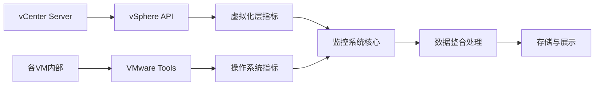
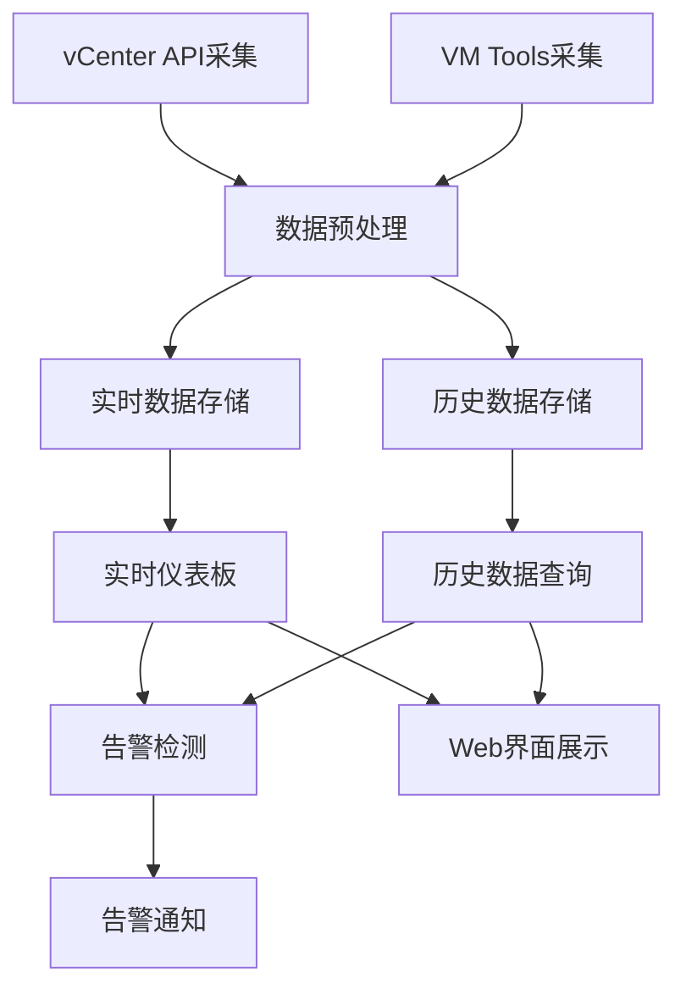

# REQ_20260202_VM监控系统_需求分析

## 文档履历

| 版本 | 日期 | 修改人 | 修改内容 | 审核状态 |
|------|------|--------|----------|----------|
| v1.0 | 2026-02-02 | AI产品经理 | 初始版本，包含基础需求分析和功能规划 | ✅ 已确认 |
| v1.1 | 2026-02-02 | AI产品经理 | **VMware技术架构更新**<br/>• 新增VMware技术架构章节<br/>• 更新为混合数据采集方案（vSphere API + VMware Tools）<br/>• 扩展VM基本信息定义（vCenter UUID、VMware Tools状态等）<br/>• 重构监控指标数据定义（分层：虚拟化层 + 操作系统层）<br/>• 新增VMware环境要求和性能约束<br/>• 增强风险评估，包含VMware特有风险识别 | 🔄 待审核 |

---

## 项目概述

开发一个企业级虚拟机监控系统，支持1500+台Linux和Windows系统的实时监控，包括CPU、内存、磁盘、网络等关键指标的实时和历史数据展示，支持基础告警功能。

## 用户角色 (Personas)

1. **系统管理员**: 负责监控系统的维护和配置管理
2. **运维工程师**: 日常监控VM状态，处理性能问题
3. **IT经理**: 查看整体资源使用情况，进行容量规划
4. **安全工程师**: 监控异常活动和潜在安全威胁

## 功能清单 (Feature List)

### P0 核心功能
- [ ] VM设备管理（添加/删除/分组）
- [ ] 实时监控数据采集（30-60秒间隔）
- [ ] 核心指标监控（CPU、内存、磁盘、网络）
- [ ] 实时仪表板展示
- [ ] 历史数据查询（时间范围筛选）
- [ ] 跨平台支持（Linux/Windows）

### P1 重要功能
- [ ] 基础告警系统（邮件/短信通知）
- [ ] 数据持久化存储（2年历史数据）
- [ ] 用户权限管理
- [ ] 监控数据导出（CSV/Excel）
- [ ] 系统健康状态总览

### P2 增强功能
- [ ] 自定义监控指标
- [ ] 告警规则配置
- [ ] 移动端适配
- [ ] API接口开放
- [ ] 系统性能优化

## VMware技术架构

### 数据获取方案
采用**混合数据采集架构**，结合vSphere API和VMware Tools：

1. **vSphere API数据源**
   - 通过vCenter Server获取虚拟化层指标
   - CPU分配、内存分配、存储性能、网络流量等VMware特有指标
   - VM配置信息：CPU核心数、内存大小、磁盘配置、网络适配器

2. **VMware Tools数据源**
   - 获取操作系统内部视角的详细指标
   - 系统负载、进程信息、文件系统使用率、网络连接数
   - 支持自定义脚本监控

### 数据采集流程


## 业务流程图



## 页面原型说明

### 1. 主仪表板页面
- **功能**: 展示所有VM的总体健康状态
- **关键元素**: 
  - 总体VM数量和状态分布
  - 实时CPU/内存/磁盘使用率概览
  - 告警通知区域
  - 快速筛选和搜索功能

### 2. VM详细监控页面
- **功能**: 单个VM的详细监控数据
- **关键元素**:
  - 实时性能图表（CPU、内存、磁盘、网络）
  - 历史数据时间范围选择器
  - 系统基本信息展示
  - 告警设置入口

### 3. 历史数据查询页面
- **功能**: 指定时间段的监控数据分析
- **关键元素**:
  - 时间范围选择器（日期时间筛选）
  - VM多选功能
  - 指标对比图表
  - 数据导出功能

### 4. 告警管理页面
- **功能**: 告警规则配置和告警历史查看
- **关键元素**:
  - 告警规则列表（新建/编辑/删除）
  - 告警历史记录
  - 通知方式配置（邮件/短信）
  - 告警级别设置

## 非功能性需求

### 性能要求
- **响应时间**: 实时数据页面加载 < 3秒
- **并发用户**: 支持500+管理员同时访问
- **数据处理**: 1500台VM数据在60秒内完成采集
- **查询性能**: 历史数据查询 < 5秒

### 安全性要求
- **身份认证**: 基于角色的访问控制（RBAC）
- **数据传输**: HTTPS加密传输
- **数据存储**: 敏感数据加密存储
- **审计日志**: 完整的操作日志记录

### 可靠性要求
- **系统可用性**: 99.9%以上
- **数据备份**: 每日自动备份，支持快速恢复
- **容错机制**: 单点故障自动切换
- **监控自监控**: 监控系统自身的健康状态

### 扩展性要求
- **水平扩展**: 支持监控VM数量扩展到5000台
- **存储扩展**: 支持分布式存储架构
- **功能扩展**: 支持自定义监控指标和告警规则

## 数据规格定义

### VM基本信息（从vCenter获取）
```typescript
interface VMInfo {
  id: string;              // vCenter VM UUID (唯一标识符)
  name: string;            // VM名称
  ip: string;              // IP地址
  os: 'Linux' | 'Windows'; // 操作系统类型
  osVersion: string;       // 操作系统版本
  cpuCores: number;        // CPU核心数
  memoryGB: number;        // 内存容量(GB)
  diskGB: number;          // 磁盘容量(GB)
  networkAdapters: number; // 网络适配器数量
  powerState: 'poweredOn' | 'poweredOff' | 'suspended'; // 电源状态
  hostId: string;          // 所在ESXi主机ID
  datacenterId: string;    // 所在数据中心ID
  clusterId: string;       // 所在集群ID
  groupId: string;          // 分组ID
  status: 'online' | 'offline' | 'error';  // 监控状态
  lastSeen: Date;          // 最后在线时间
  vmwareToolsStatus: 'installed' | 'notInstalled' | 'running'; // VMware Tools状态
}
```

### 监控指标数据（混合数据源）

#### vSphere API指标（虚拟化层）
```typescript
interface VSphereMetrics {
  vmId: string;        // VM标识
  timestamp: Date;     // 时间戳
  dataSource: 'vSphere'; // 数据来源
  
  // CPU指标（虚拟化层视角）
  cpuUsageMHz: number;        // CPU使用率(MHz)
  cpuReady: number;           // CPU就绪时间百分比
  cpuWait: number;            // CPU等待时间百分比
  cpuLimit: number;           // CPU限制(MHz)
  cpuReservation: number;     // CPU预留(MHz)
  cpuShares: number;          // CPU份额
  
  // 内存指标（虚拟化层视角）
  memoryUsageMB: number;        // 内存使用量(MB)
  memoryGrantedMB: number;      // 已分配内存(MB)
  memoryActiveMB: number;        // 活跃内存(MB)
  memoryBalloonedMB: number;     // 气球内存(MB)
  memoryCompressedMB: number;    // 压缩内存(MB)
  memorySwappedMB: number;       // 交换内存(MB)
  
  // 存储指标（虚拟化层视角）
  diskReadLatency: number;       // 磁盘读取延迟(ms)
  diskWriteLatency: number;      // 磁盘写入延迟(ms)
  diskReadIOPS: number;          // 磁盘读取IOPS
  diskWriteIOPS: number;         // 磁盘写入IOPS
  diskThroughput: number;        // 磁盘吞吐量(MB/s)
  
  // 网络指标（虚拟化层视角）
  networkInBps: number;         // 网络入流量(bps)
  networkOutBps: number;        // 网络出流量(bps)
  networkInPps: number;         // 入包数(pps)
  networkOutPps: number;        // 出包数(pps)
  networkDroppedPackets: number; // 丢包数
}
```

#### VMware Tools指标（操作系统层）
```typescript
interface GuestOSMetrics {
  vmId: string;        // VM标识
  timestamp: Date;     // 时间戳
  dataSource: 'GuestOS'; // 数据来源
  
  // CPU指标（操作系统视角）
  cpuUsagePercent: number;    // CPU使用率百分比
  cpuLoad1min: number;       // 1分钟负载平均值
  cpuLoad5min: number;       // 5分钟负载平均值
  cpuLoad15min: number;      // 15分钟负载平均值
  cpuContextSwitches: number; // 上下文切换次数
  
  // 内存指标（操作系统视角）
  memoryTotalMB: number;     // 总内存(MB)
  memoryUsedMB: number;      // 已用内存(MB)
  memoryFreeMB: number;      // 可用内存(MB)
  memoryBuffersMB: number;   // 缓冲区内存(MB)
  memoryCachedMB: number;    // 缓存内存(MB)
  memorySwapMB: number;      // 交换分区使用(MB)
  
  // 磁盘指标（操作系统视角）
  diskUsagePercent: number;     // 磁盘使用率百分比
  diskUsedMB: number;           // 已用空间(MB)
  diskFreeMB: number;           // 可用空间(MB)
  diskInodesTotal: number;      // 总inode数(Linux)
  diskInodesUsed: number;       // 已用inode数(Linux)
  diskReadBytes: number;        // 磁盘读取字节数
  diskWriteBytes: number;       // 磁盘写入字节数
  
  // 网络指标（操作系统视角）
  networkInBytes: number;       // 网络入流量字节数
  networkOutBytes: number;      // 网络出流量字节数
  networkInPackets: number;     // 入包数
  networkOutPackets: number;    // 出包数
  networkErrors: number;        // 网络错误包数
  networkDropped: number;        // 丢包数
  
  // 系统指标
  uptime: number;               // 系统运行时间(秒)
  processTotal: number;         // 总进程数
  processRunning: number;       // 运行中进程数
  processSleeping: number;       // 休眠进程数(Linux)
  
  // 特定于Linux的指标
  loadAverage?: {               // 负载平均值(Linux)
    '1min': number;
    '5min': number;
    '15min': number;
  };
  
  // 特定于Windows的指标
  windowsMetrics?: {             // Windows特有指标
    availableMemoryMB: number;   // 可用内存(MB)
    committedMemoryMB: number;   // 已提交内存(MB)
    cacheMemoryMB: number;       // 缓存内存(MB)
    systemUptime: string;        // 系统运行时间
  };
}

// 统一的监控数据接口
interface MonitorData extends Partial<VSphereMetrics>, Partial<GuestOSMetrics> {
  vmId: string;
  timestamp: Date;
}
```

### 告警规则定义
```typescript
interface AlertRule {
  id: string;
  name: string;
  vmId?: string;       // 特定VM，空表示全局规则
  metric: 'cpu' | 'memory' | 'disk' | 'network';
  operator: '>' | '<' | '>=' | '<=';
  threshold: number;   // 阈值
  duration: number;     // 持续时间(秒)
  severity: 'low' | 'medium' | 'high' | 'critical';
  enabled: boolean;
  notificationMethods: ('email' | 'sms')[];
  recipients: string[]; // 通知对象
}
```

## 技术约束

### VMware环境要求
- **vCenter Server**: 6.5及以上版本
- **ESXi主机**: 6.5及以上版本
- **VMware Tools**: 所有VM必须安装并运行
- **网络权限**: 监控服务器需有vCenter和各VM的网络访问权限
- **API访问**: vCenter API访问权限和足够的许可证

### 部署环境
- 本地私有云/数据中心部署
- 内网环境，无外网访问依赖
- 支持容器化部署
- 高可用架构，支持集群部署

### 数据存储
- 历史数据保留2年
- 实时数据快速查询
- 支持数据压缩和归档
- 分层存储：热数据（最近7天）、温数据（30天）、冷数据（2年）

### 兼容性要求
- **VMware版本**: vCenter 6.5+, ESXi 6.5+
- **操作系统**: 支持主流Linux发行版（CentOS, Ubuntu, RHEL等）和Windows Server 2016+
- **VMware Tools**: 支持所有版本的VMware Tools
- **浏览器**: 支持Chrome、Firefox、Edge等现代浏览器

### 性能约束
- **vCenter API调用**: 遵守vCenter API速率限制
- **并发连接**: 单个vCenter最多50个并发API连接
- **数据采集**: 分批采集，避免同时访问所有VM
- **存储优化**: 使用时序数据库优化存储和查询性能

## 风险评估

### VMware特有风险
1. **vCenter单点故障**: vCenter故障将影响虚拟化层数据采集
2. **API速率限制**: vCenter API调用频率受限，影响数据实时性
3. **VMware Tools依赖**: VM Tools故障会影响操作系统层数据采集
4. **许可证限制**: vCenter许可证可能限制API功能

### 技术风险
1. **大规模数据采集性能**: 1500台VM同时采集可能造成网络压力
2. **长期存储成本**: 2年历史数据存储成本较高
3. **跨平台兼容性**: Linux和Windows系统差异

### 缓解措施
1. **vCenter冗余**: 部署vCenter高可用集群，配置备用数据源
2. **API优化**: 实施智能调度和缓存机制，优化API调用效率
3. **分层监控**: vCenter API故障时，优先保证VM Tools数据采集
4. **混合采集**: 结合vSphere API和VMware Tools，提供完整数据覆盖
5. **分布式架构**: 采用分布式采集架构，分批进行数据收集
6. **分层存储**: 实施数据压缩和分层存储策略
7. **统一数据模型**: 使用统一的数据格式，兼容不同操作系统

---

## 变更记录模板

### 未来更新指南
每次修改此需求文档时，请按以下格式记录：

```markdown
### 版本 vX.Y (YYYY-MM-DD)
**修改人**: [姓名]
**修改原因**: [简述修改背景]
**具体修改**:
- [ ] 新增功能/需求
- [ ] 修改现有需求
- [ ] 删除过时需求
**影响范围**: 
- 前端界面: [是/否]
- 后端API: [是/否]  
- 数据库结构: [是/否]
- 部署配置: [是/否]
**相关文档**: [关联的其他文档]
**备注**: [其他说明]
```

---

**文档管理说明**:
1. 每次重大修改必须更新履历表
2. 小幅修改可在当前版本内累计
3. 每月进行一次版本整理和审核
4. 所有修改需经过相关干系人确认

**文档保存建议**: 请将此文档保存至 `docs/requirements/REQ_20260202_VM监控系统.md`